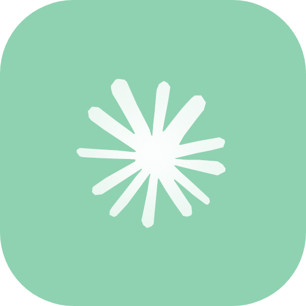
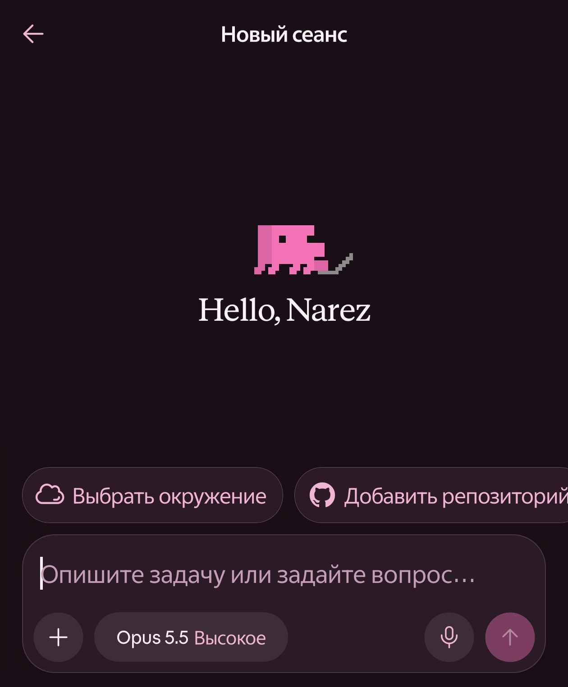
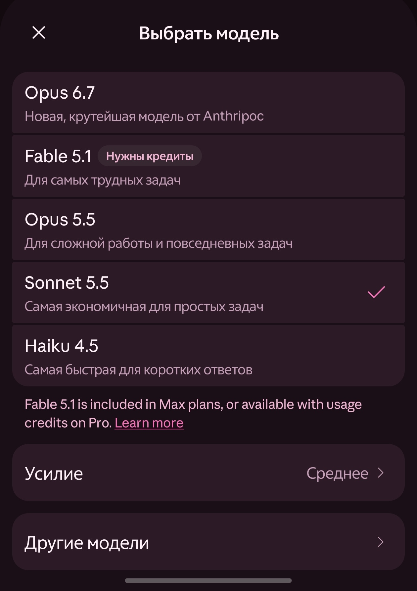

<div align="center">



# MargyC

**Margy Claude — a mod for the Claude Android app.**<br>
Russian UI, your own themes, meme models, a Clawd pet on the composer and mods you write yourself.

<a href="https://github.com/narezy/MargyC/raw/Download/MargyC.apk"></a>
<a href="https://t.me/margyclaude"></a>
<a href="docs/plugins.md"></a>
<a href="https://yoomoney.ru/to/4100118196133693"></a>


<br><br>


&nbsp;&nbsp;


</div>

## Features

| | |
|---|---|
| 🇷🇺 **Russian UI** | the whole app in Russian, including model descriptions that come from the server |
| 🎨 **Accent color & themes** | recolor Claude's orange, or every color of the dark and light themes. Share a theme as plain text — or just ask Claude to write one: it knows the format and your phone's Material You palette |
| 🧠 **System prompt presets** | hidden context sent with every message: the built-in presets tell Claude about the mod, your device, every MargyC feature and your enabled mods — or write your own |
| 🤡 **Meme models** | add "Fable 6969" to the model picker. A real model of your choice answers, with its own system prompt on top. Share models as text |
| 🦀 **Clawd pet** | the app's own animated Clawd sits on top of the message box in chat and Code, follows it as it grows, can be dragged around and jumps when tapped |
| 📝 **Conversation export** | "Download conversation (.md)" in the chat's ⋮ menu; open a .md on the Mods screen to read it as a chat and continue it in Claude |
| 🧩 **Custom mods** | install `.mcmod` plugins: compiled dex with a manifest, settings drawn by the app. [Write your own](docs/plugins.md) |
| 🌐 **Russian or English** | the Mods screen follows the app language |
| 💥 **Crash log** | if the app crashes, the next start shows the stack trace with a copy button |

Everything lives in **Моды** (Mods) in the side menu. Changes that need a restart pile up, and a bar at
the bottom of the Mods screen restarts Claude once when you are done.

## Install

1. Download [`MargyC.apk`](https://github.com/narezy/MargyC/raw/Download/MargyC.apk) from the
   [`Download`](https://github.com/narezy/MargyC/tree/Download) branch.
2. Install it. MargyC is a separate app (`cat.narezany.claude`), so the original Claude stays.
3. Sign in **with email** (a code arrives by mail). Google sign-in is tied to the original app and
   does not work in a mod.

Updates install over the previous version. There are no Play Store updates: follow the
[Telegram channel](https://t.me/margyclaude).

## Build from source

You need Python 3.8+ and JDK 17+. The other tools (apktool, APKEditor, d8, uber-apk-signer,
android.jar) are downloaded to `~/.cache/claude-mods` on first run.

```sh
python3 patcher.py com.anthropic.claude_<version>.xapk -o MargyC.apk
```

The input is the original Claude as XAPK / APKS / APKM, a folder of splits or an APK.
`--abi all` keeps every architecture (only `arm64-v8a` by default).

The patcher finds every hook by strings and signatures (kotlinx.serialization descriptors,
`toString()` of data classes, Compose internals), not by obfuscated names, so it has a chance to
survive Claude updates — and when it cannot find something, it says exactly what.

**Signing key.** The key is not in this repository: with it anyone could sign an "update" that
installs over MargyC. Put yours into `keystore/` (ignored by git) or point `MARGYC_KEYSTORE`
(+ `MARGYC_KEY_ALIAS`, `MARGYC_KEY_PASS`) to it. Without a key the patcher creates a new one, and
the result will not install over a MargyC signed with another key.

## Repository

| Path | |
|---|---|
| [`patcher.py`](patcher.py) | XAPK → merged APK → manifest, resource and smali patches → build → sign |
| [`src/cat/narezany/mods`](src/cat/narezany/mods) | the mod itself: Mods screen, themes, prompt, meme models, Clawd, plugin loader |
| [`src/cat/narezany/mods/api`](src/cat/narezany/mods/api) | the API for custom mods |
| [`docs/plugins.md`](docs/plugins.md) | how to write a mod |
| [`examples/hello`](examples/hello) | an example mod |
| [`tools/build_mod.py`](tools/build_mod.py) | builds a `.mcmod` |
| [`res/values-ru`](res/values-ru) | the Russian translation |

## Support the author

- Bank card: `2204 1201 4305 5305`
- YooMoney: [yoomoney.ru/to/4100118196133693](https://yoomoney.ru/to/4100118196133693)

The same details are on the Mods screen, in *Поддержать автора*.

## Links

- Telegram channel: [@margyclaude](https://t.me/margyclaude)
- Author: [@narezany](https://t.me/narezany)

## License

MargyC is free software under the [GNU GPL version 3](LICENSE). You may change and share it, with the source.
Under the [additional terms](NOTICE) (GPL section 7b), every copy and fork must keep the author attribution
(narezany) and the author's donation details on the Mods screen.

<sub>Icons on the Mods screen: [Material Icons](https://github.com/google/material-design-icons) by Google, Apache License 2.0.</sub>

<sub>MargyC is an unofficial fan modification. It is not affiliated with, endorsed by or supported by
Anthropic. Claude is a trademark of Anthropic. Use at your own risk.</sub>
